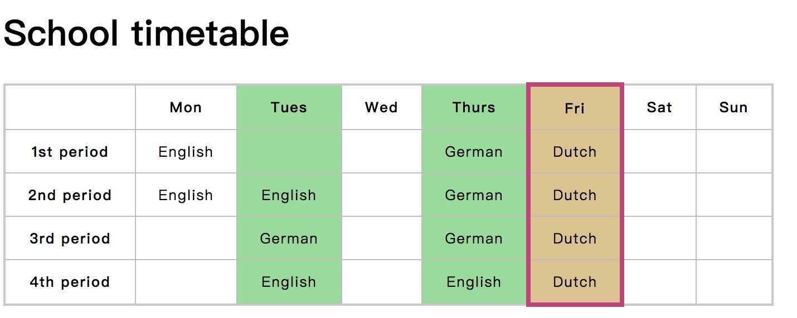

# This is the document for MDNdocs task
<h2><a href="https://developer.mozilla.org/en-US/docs/Learn/HTML/Introduction_to_HTML/Marking_up_a_letter">1. Marking up a letter</a></h2>
 
Result

 

<h2><a href="https://developer.mozilla.org/en-US/docs/Learn/HTML/Introduction_to_HTML/Structuring_a_page_of_content">2. Structuring a page of content
</a></h2>
 
Result

<h2><a href="https://developer.mozilla.org/en-US/docs/Learn/HTML/Multimedia_and_embedding/Mozilla_splash_page">3. Mozilla splash page
</a></h2>
 
Result

<h2><a href="https://developer.mozilla.org/en-US/docs/Learn/HTML/Tables/Basics">4. Timetable
</a></h2>
 
Result

<h2><a href="https://developer.mozilla.org/en-US/docs/Learn/HTML/Tables/Structuring_planet_data">5. Structuring planet data
</a></h2>
 
Result

<h2><a href="https://developer.mozilla.org/en-US/docs/Learn/HTML/Forms/How_to_structure_an_HTML_form">6.Build a payment form
</a></h2>
 
Result

<h2><a href="https://developer.mozilla.org/zh-CN/docs/Learn/HTML/Forms/Styling_HTML_forms">7. Postcard
</a></h2>
 
Result

<h2><a href="https://developer.mozilla.org/zh-CN/docs/Learn/HTML/Forms/Styling_HTML_forms">8. Punk bands table
</a></h2>
 
Result

