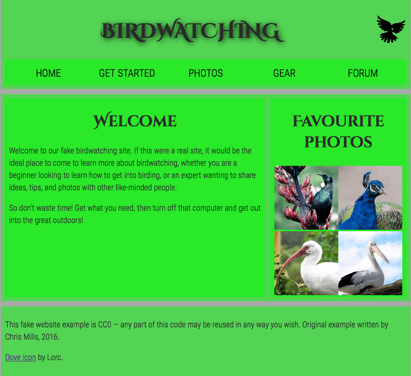

# This is the document for MDNdocs task
<h1><a href="https://developer.mozilla.org/en-US/docs/Learn/HTML/Introduction_to_HTML/Marking_up_a_letter">Marking up a letter</a></h1>
 
Result

 

<h1><a href="https://developer.mozilla.org/en-US/docs/Learn/HTML/Introduction_to_HTML/Structuring_a_page_of_content">Structuring a page of content
</a></h1>
 
Result

